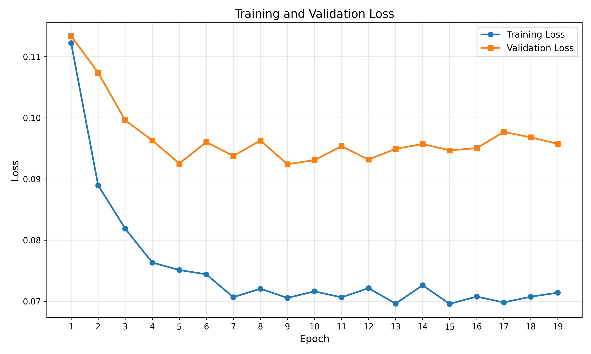
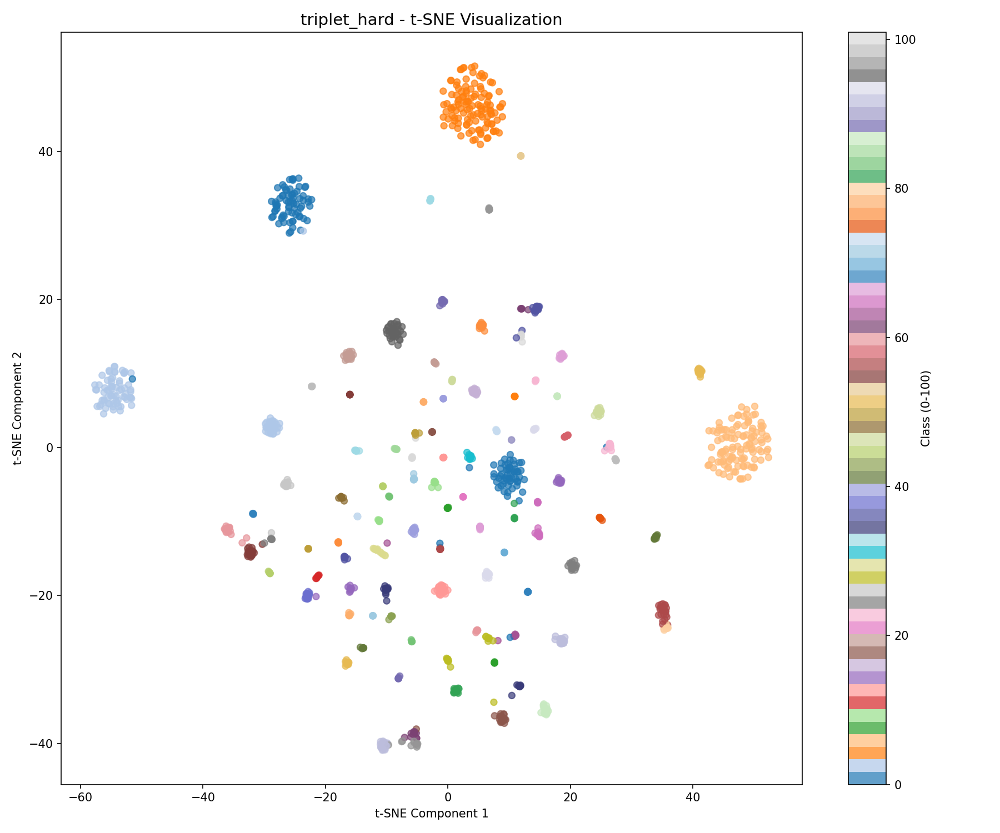
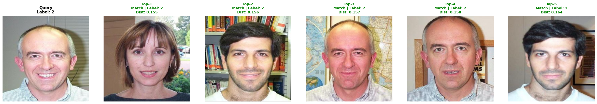
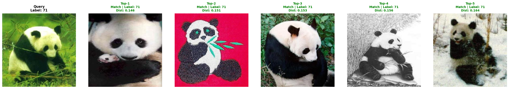
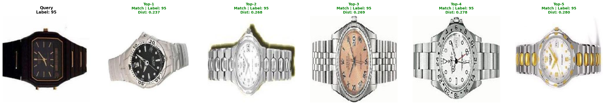

# Deep Metric Learning for Image Retrieval

Standard classification trains a network to predict a fixed set of class labels. Metric learning does something different: it trains a network to produce embeddings where similar images are close together in vector space and dissimilar ones are pushed apart. You can then retrieve the most similar images to any query by finding the nearest neighbors in that learned embedding space — no class labels needed at query time.

This project implements and compares three metric learning losses on the Caltech-101 dataset, using a ResNet50 backbone to produce 128-dimensional L2-normalized embeddings.

## The Problem

Given a query image of, say, an accordion or a face, find the most visually similar images from a catalog of thousands. Standard cross-entropy classifiers cannot generalize to new categories or to retrieval at scale. Metric learning solves this by learning a geometry of similarity rather than a fixed class boundary.

## What I Built

### Model Architecture

ResNet50 pretrained on ImageNet is used as a feature extractor. The final classification layer is replaced with a linear projection to a 128-dimensional embedding space, followed by L2 normalization:

```
Input Image → ResNet50 (2048-d features) → Linear(2048 → 128) → L2 Normalize → Embedding
```

L2 normalization constrains all embeddings to the unit hypersphere. This means cosine similarity equals the dot product — retrieval becomes a simple matrix multiply.

### Three Loss Functions Compared

**Triplet Loss with Hard Mining** — For each anchor in a batch, select the hardest positive (same class, farthest embedding) and hardest negative (different class, closest embedding). This focuses training on the examples the model is currently getting wrong. Achieved the best results.

**Triplet Loss with Random Sampling** — Same triplet margin objective but with randomly selected positives and negatives. Easier to implement, faster to train, slightly lower performance.

**Contrastive Loss** — Operates on image pairs rather than triplets. Pulls together same-class pairs and pushes apart different-class pairs beyond a margin.

The core triplet margin objective is:
```
L = max(0, d(anchor, positive) - d(anchor, negative) + margin)
```

## Results

### Training Loss — Triplet Hard Mining (Best Model)



### t-SNE Embedding Visualization

After training, the 128-d embeddings cluster cleanly by class. This is what "the model learned a useful geometry" looks like:



### Image Retrieval Results

Given a query image, the model returns the top-10 most similar images. Each row below is one query:





### Performance Summary

| Loss Function | mAP@1 | mAP@10 |
|---|---|---|
| **Triplet Hard Mining** | **98%** | **92%** |
| Triplet Random | 96% | 89% |
| Contrastive | 94% | 87% |

Query latency is under 5ms because embeddings for all catalog images are pre-computed and stored. At query time, only a cosine similarity search is needed.

## How to Run

```bash
pip install -r requirements.txt
```

**Train all three models and evaluate:**
```bash
python main.py --epochs 30 --batch-size 64 --lr 0.001 --weight-decay 1e-4
```

**Pre-compute and save embeddings for fast retrieval:**
```bash
python save_embeddings.py --data-dir caltech-101 --weights-dir weights --output-dir embeddings
```

**Evaluate retrieval quality on saved embeddings:**
```bash
python evaluate.py --data-dir caltech-101 --embeddings-dir embeddings --output-dir graphs
```

**Run inference on a single image:**
```bash
python inference.py --image path/to/image.jpg --weights weights/triplet_hard_best.pth
```

### Training Options

| Flag | Default | Description |
|---|---|---|
| `--epochs` | 30 | Training epochs |
| `--batch-size` | 32 | Batch size |
| `--lr` | 0.001 | Learning rate |
| `--weight-decay` | 1e-4 | L2 regularization |
| `--skip-train` | False | Skip to evaluation only |
| `--skip-embeddings` | False | Skip embedding generation |
| `--skip-eval` | False | Skip evaluation |
